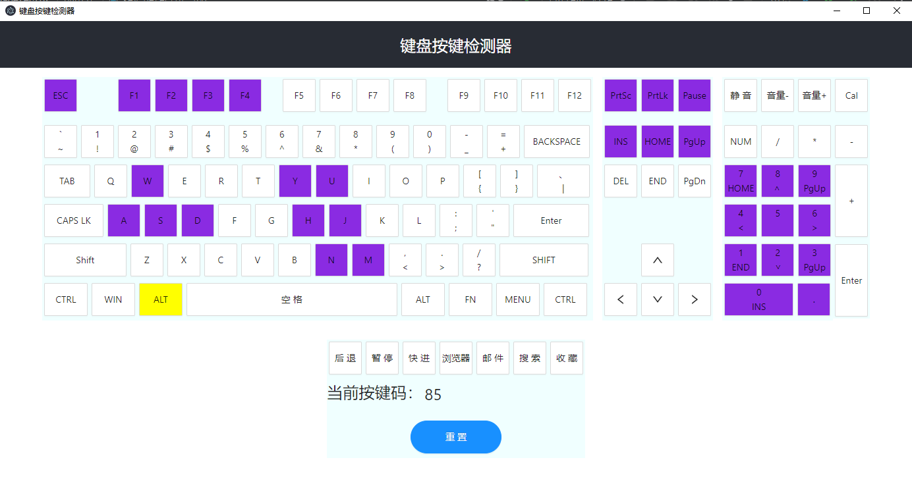

# 键盘按键检测器

本程序基于 [Create React App](https://github.com/facebook/create-react-app)开发， 与目前的其他按键检测器相比，增加了多媒体键的检测，后续可以补充更多多媒体键。 本程序阻止了浏览器的默认行为，如F11全屏，F12打开开发者工具等

## 可运行的命令

### `yarn start`

会自动使用默认浏览器打开站点 [http://localhost:3000](http://localhost:3000). 即可使用本检测程序

### `yarn build`

编译到目录 `build` 下.

### `yarn electronstart`

使用窗口方式打开，先yarn build再执行本命令

## 键码对照表

### 功能键键码值

| 键   | 键码  | 键   | 键码  |
|-----|-----|-----|-----|
| F1  | 112 | F7  | 118 |
| F2  | 113 | F8  | 119 |
| F3  | 114 | F9  | 120 |
| F4  | 115 | F10 | 121 |
| F5  | 116 | F11 | 122 |
| F6  | 117 | F12 | 123 |

### 数字键盘上的各键键码值

| 键   | 键码  | 键     | 键码  |
|-----|-----|-------|-----|
| 0   | 96  | 8     | 104 |
| 1   | 97  | 9     | 105 |
| 2   | 98  | *     | 106 |
| 3   | 99  | +     | 107 |
| 4   | 100 | Enter | 108 |
| 5   | 101 | -     | 109 |
| 6   | 102 | .     | 110 |
| 7   | 103 | /     | 111 |

### 字母和数字键的键码值

| 键   | 键码  | 键   | 键码  | 键   | 键码  | 键   | 键码  |
|-----|-----|-----|-----|-----|-----|-----|-----|
| A   | 65  | J   | 74  | S   | 83  | 1   | 49  |
| B   | 66  | K   | 75  | T   | 84  | 2   | 50  |
| C   | 67  | L   | 76  | U   | 85  | 3   | 51  |
| D   | 68  | M   | 77  | V   | 86  | 4   | 52  |
| E   | 69  | N   | 78  | W   | 87  | 5   | 53  |
| F   | 70  | O   | 79  | X   | 88  | 6   | 54  |
| G   | 71  | P   | 80  | Y   | 89  | 7   | 55  |
| H   | 72  | Q   | 81  | Z   | 90  | 8   | 56  |
| I   | 73  | R   | 82  | 0   | 48  | 9   | 57  |

### 控制键键码值
| 键         | 键码             | 键         | 键码              | 键          | 键码             | 键   | 键码  |
|-----------|----------------|-----------|-----------------|------------|----------------|-----|-----|
| BackSpace | 8              | Esc       | 27              | RightArrow | 39             | -_  | 189 |
| Tab       | 9              | MENU      | 93              | DownArrow  | 40             | .>  | 190 |
| WIN       | 91             | Page Up   | 33              | Insert     | 45             | /?  | 191 |
| Enter     | 13             | Page Down | 34              | Delete     | 46             | `~  | 192 |
| Shift     | 16             | End       | 35              | Num        | win:144 mac:12 | [{  | 219 |
| Control   | 17             | Home      | 36              | ;:         | 186            | \   | 220 |
| Alt       | 18             | LeftArrow | 37              | =+         | 187            | ]}  | 221 |
| CapsLock  | 20             | UpArrow   | 38              | ,<         | 188            | '"  | 222 |
| PrtSc     | win:44 mac:124 | PrtLk     | win:145 mac:125 | Pause      | win:19 mac:126 |

### 多媒体键
| 键   | 键码  | 键   | 键码  |
|-----|-----|-----|-----|
| 后退  | 177 | 浏览器 | 172 |
| 暂停  | 179 | 邮件  | 180 |
| 快进  | 176 | 搜索  | 170 |
| 静音  | 173 | 收藏  | 171 |
| 音量减 | 174 |
| 音量加 | 175 |

### 运行界面

